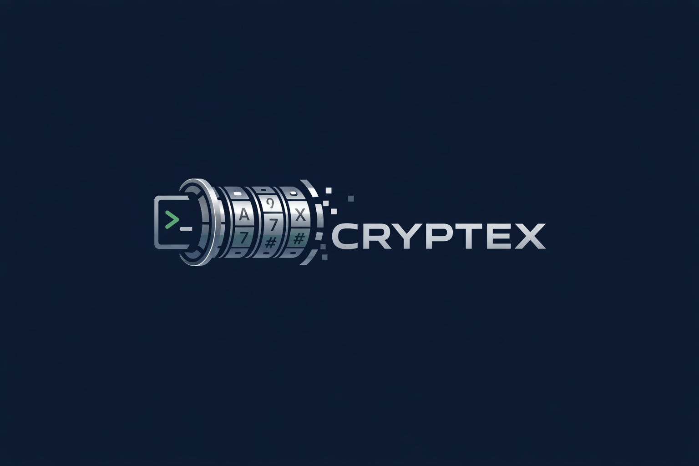

# Cryptex - Enterprise Password Generator

<p align="center">
  
</p>

[](https://pypi.org/project/cryptex-cli/)
[](https://pepy.tech/project/cryptex-cli)
[](https://python.org)
[](https://opensource.org/licenses/MIT)
[](https://docs.python.org/3/library/secrets.html)
[](https://click.palletsprojects.com/)

A **production-ready CLI tool** for generating cryptographically secure passwords with enterprise integrations, compliance templates, and advanced customization options.

## Key Features

### Core Security
- **Cryptographically Secure**: Uses Python's `secrets` module for secure random generation
- **Multiple Password Types**: Strong, pronounceable, alphabetic, numeric, API keys, and custom character sets
- **Strength Analysis**: Real-time password strength scoring and entropy calculation
- **QR Code Generation**: Native Python QR codes (no external dependencies)

### Enterprise Integrations
- **AWS Secrets Manager**: Direct save with profile support
- **HashiCorp Vault**: Enterprise secret management integration
- **OS Keychain**: Native macOS/Linux/Windows keychain storage
- **Key-Value Pairs**: Bulk generation for environment files and applications

### Compliance and Templates
- **Pre-built Templates**: NIST 800-63B, PCI-DSS, OWASP, high-security, user-friendly, database-safe, WiFi
- **Custom Policies**: Define your own password requirements
- **Audit Ready**: Comprehensive logging and validation

### Advanced Features
- **Multiple Output Formats**: Plain text, JSON, CSV, environment variables
- **Clipboard Integration**: Direct copy to clipboard (macOS/Linux)
- **Silent Mode**: Hide passwords for automation and CI/CD
- **Bulk Generation**: Generate multiple passwords with different names

## Installation

### Simple Installation (Recommended)
```bash
pip install cryptex-cli
```

### From Source
```bash
git clone https://github.com/TocConsulting/cryptex.git
cd cryptex
pip install .
```

### Development Installation
```bash
git clone https://github.com/TocConsulting/cryptex.git
cd cryptex
pip install -e ".[dev]"
```

## Quick Start

```bash
# Basic password generation
cryptex                                    # 16-char strong password
cryptex -l 20 -q                         # 20-char password, silent mode

# API key generation
cryptex -t api-key --api-format uuid      # UUID format API key
cryptex -t api-key --api-format hex -l 32 # 32-char hex API key

# Environment files
cryptex --kv "DB_PASSWORD,API_KEY,JWT_SECRET" -f env > .env

# Compliance templates
cryptex --template nist-800-63b           # NIST compliant password
cryptex --template database               # Database-safe password
cryptex --list-templates                  # Show all templates

# Enterprise storage
cryptex -l 20 --save-keychain --keychain-service "MyApp" --keychain-account "admin"
cryptex -l 32 --save-aws --aws-secret-name "prod/api-key" --aws-profile production
cryptex --template high-security --save-vault --vault-path "secret/admin-password"
```

## Complete Usage Guide

### Basic Password Generation

```bash
# Different password types
cryptex -t strong                         # Mixed characters (default)
cryptex -t alpha                          # Letters only
cryptex -t alphanum                       # Letters and numbers
cryptex -t numeric                        # Numbers only
cryptex -t pronounce                      # Pronounceable passwords

# Customization
cryptex -l 24 --min-upper 3 --min-digit 3 --min-special 2
cryptex --no-similar -x "0O1l"           # Exclude similar/confusing chars
cryptex -c 5 --separator ","              # Generate 5 passwords, comma-separated
```

### API Key Generation

```bash
# Different API key formats
cryptex -t api-key --api-format uuid      # xxxxxxxx-xxxx-xxxx-xxxx-xxxxxxxxxxxx
cryptex -t api-key --api-format uuid-hex  # xxxxxxxxxxxxxxxxxxxxxxxxxxxxxxxx
cryptex -t api-key --api-format base64 -l 32  # Base64 encoded (URL-safe)
cryptex -t api-key --api-format hex -l 40     # Hexadecimal
cryptex -t api-key --api-format url-safe -l 32 # URL-safe characters
cryptex -t api-key --api-format alphanum -l 28 # Letters and numbers only
```

### Key-Value Pair Generation

Perfect for generating multiple related secrets:

```bash
# Environment files
cryptex --kv "DATABASE_URL,REDIS_PASSWORD,JWT_SECRET" -f env
# Output:
# DATABASE_URL="x8P$mK9#vL2nR@5q"
# REDIS_PASSWORD="N7!wQ&3xM*8pF$2y"
# JWT_SECRET="K5@tL%9vN#6mP!8r"

# JSON format for applications
cryptex --kv "api_key,webhook_secret" -f json
# Output:
# {
#   "api_key": "H8$mN9@vL3#qR7!w",
#   "webhook_secret": "P2&xK5*yM8$nL6@t"
# }

# CSV for spreadsheets
cryptex --kv "user1,user2,user3" -f csv
# Output:
# key,value
# "user1","R7@mK9$vL3#qN5!w"
# "user2","P8&xM2*yL6$nK9@t"
# "user3","Q3#vN7!wM8$xL2&p"
```

### Compliance Templates

```bash
# List all available templates
cryptex --list-templates

# Available templates:
cryptex --template nist-800-63b           # NIST 800-63B compliant (12+ chars, mixed)
cryptex --template pci-dss                # PCI DSS compliant (12+ chars)
cryptex --template owasp                  # OWASP recommended (14+ chars)
cryptex --template high-security          # Maximum security (20+ chars)
cryptex --template user-friendly          # No special chars, easy to type
cryptex --template database               # Safe for SQL connections
cryptex --template wifi                   # Easy to type on mobile devices
```

### Enterprise Storage Integration

#### AWS Secrets Manager
```bash
# Setup AWS credentials first:
aws configure
# OR set environment variables:
export AWS_ACCESS_KEY_ID="your-key"
export AWS_SECRET_ACCESS_KEY="your-secret"
export AWS_DEFAULT_REGION="us-east-1"

# Save single password
cryptex -l 32 --save-aws --aws-secret-name "prod/database-password"

# Use specific AWS profile
cryptex -l 20 --save-aws --aws-secret-name "api-keys/external" --aws-profile production

# Save key-value pairs as JSON
cryptex --kv "db_user,db_password,api_key" --save-aws --aws-secret-name "myapp/credentials"

# Silent mode for automation
cryptex -q --template high-security --save-aws --aws-secret-name "prod/admin-password"
```

#### HashiCorp Vault
```bash
# Setup Vault connection:
export VAULT_ADDR='http://127.0.0.1:8200'
export VAULT_TOKEN='your-vault-token'

# Save single password
cryptex -l 24 --save-vault --vault-path "secret/myapp/database"

# Save multiple secrets
cryptex --kv "api_key,webhook_secret,jwt_token" --save-vault --vault-path "secret/myapp/tokens"

# Custom Vault server
cryptex -l 20 --save-vault --vault-path "secret/prod/admin" --vault-url "https://vault.company.com"

# Silent automation
cryptex -q --template nist-800-63b --save-vault --vault-path "secret/compliance/audit"
```

#### OS Keychain Integration
```bash
# macOS Keychain / Linux GNOME Keyring / Windows Credential Manager

# Save single password
cryptex -l 16 --save-keychain --keychain-service "MyApp" --keychain-account "admin"

# Save multiple passwords (each gets its own keychain entry)
cryptex --kv "dev_admin,staging_admin,prod_admin" --save-keychain --keychain-service "MyApp-DB"

# Custom service name
cryptex -l 20 --save-keychain --keychain-service "EmailServer" --keychain-account "smtp-auth"

# Silent mode
cryptex -q --template database --save-keychain --keychain-service "DatabaseCluster" --keychain-account "readonly"
```

### Output Formats

```bash
# Plain text (default)
cryptex -c 3
# Output: Three passwords, one per line

# JSON format
cryptex -c 2 -f json
# Output:
# [
#   {"id": 1, "password": "x8P$mK9#vL2nR@5q"},
#   {"id": 2, "password": "N7!wQ&3xM*8pF$2y"}
# ]

# CSV format
cryptex -c 2 -f csv
# Output:
# id,password
# 1,"x8P$mK9#vL2nR@5q"
# 2,"N7!wQ&3xM*8pF$2y"

# Environment variables
cryptex -c 3 -f env
# Output:
# PASSWORD_1="x8P$mK9#vL2nR@5q"
# PASSWORD_2="N7!wQ&3xM*8pF$2y"
# PASSWORD_3="K5@tL%9vN#6mP!8r"
```

### Advanced Features

```bash
# Password analysis
cryptex -l 16 -v
# Shows strength score, entropy, character breakdown

# QR code generation (great for WiFi passwords)
cryptex --template wifi --qr

# Clipboard integration
cryptex -l 20 --copy                      # Copy to clipboard
cryptex --template user-friendly --copy   # Generate user-friendly and copy

# File output
cryptex -c 10 -f json passwords.json      # Save to file
cryptex --kv "user1,user2,user3" -f csv users.csv

# Custom character sets
cryptex -t custom --custom-charset "ABCDEF0123456789" -l 16  # Hex-like
cryptex -s "!@#$" -x "0O1l"               # Custom special chars, exclude confusing
```

## Complete Options Reference

| Option | Description | Default | Example |
|--------|-------------|---------|---------|
| `-l, --length` | Password length (8-256) | 16 | `-l 20` |
| `-c, --count` | Number of passwords | 1 | `-c 5` |
| `-t, --type` | Password type | strong | `-t api-key` |
| `-s, --special` | Custom special characters | `!@#$%^&*()_+-=[]{}|;:,.<>?` | `-s "!@#$"` |
| `-x, --exclude` | Exclude specific characters | None | `-x "0O1l"` |
| `--no-similar` | Exclude similar chars (il1Lo0O) | False | `--no-similar` |
| `--min-upper` | Minimum uppercase letters | 0 | `--min-upper 2` |
| `--min-lower` | Minimum lowercase letters | 0 | `--min-lower 2` |
| `--min-digit` | Minimum digits | 0 | `--min-digit 3` |
| `--min-special` | Minimum special characters | 0 | `--min-special 1` |
| `-f, --format` | Output format | plain | `-f json` |
| `--separator` | Separator for multiple passwords | newline | `--separator ","` |
| `--copy` | Copy to clipboard | False | `--copy` |
| `--qr` | Generate QR code | False | `--qr` |
| `-q, --quiet` | Silent mode (hide passwords) | False | `-q` |
| `-v, --verbose` | Show password analysis | False | `-v` |
| `--template` | Use compliance template | None | `--template nist-800-63b` |
| `--list-templates` | List available templates | False | `--list-templates` |
| `--kv` | Generate key-value pairs | None | `--kv "api,db,jwt"` |
| `--api-format` | API key format | alphanum | `--api-format uuid` |
| `--save-aws` | Save to AWS Secrets Manager | False | `--save-aws` |
| `--aws-secret-name` | AWS secret name | None | `--aws-secret-name "prod/api"` |
| `--aws-region` | AWS region | us-east-1 | `--aws-region us-west-2` |
| `--aws-profile` | AWS profile name | None | `--aws-profile production` |
| `--save-vault` | Save to HashiCorp Vault | False | `--save-vault` |
| `--vault-path` | Vault secret path | None | `--vault-path "secret/myapp"` |
| `--vault-url` | Vault server URL | http://localhost:8200 | `--vault-url "https://vault.company.com"` |
| `--save-keychain` | Save to OS keychain | False | `--save-keychain` |
| `--keychain-service` | Keychain service name | cryptex | `--keychain-service "MyApp"` |
| `--keychain-account` | Keychain account name | None | `--keychain-account "admin"` |

## Setup Guides

### AWS Secrets Manager Setup
```bash
# Option 1: AWS CLI
pip install awscli
aws configure

# Option 2: Environment Variables
export AWS_ACCESS_KEY_ID="your-access-key-id"
export AWS_SECRET_ACCESS_KEY="your-secret-access-key"
export AWS_DEFAULT_REGION="us-east-1"

# Option 3: Multiple Profiles (~/.aws/credentials)
[default]
aws_access_key_id = your-default-key
aws_secret_access_key = your-default-secret

[production]
aws_access_key_id = your-prod-key
aws_secret_access_key = your-prod-secret

# Test connection
aws sts get-caller-identity
cryptex -l 20 --save-aws --aws-secret-name "test-secret"
```

### HashiCorp Vault Setup
```bash
# Install Vault
brew install hashicorp/tap/vault  # macOS
# OR download from https://www.vaultproject.io/downloads

# Start development server
vault server -dev
# Note the Root Token from output

# Configure client (in new terminal)
export VAULT_ADDR='http://127.0.0.1:8200'
export VAULT_TOKEN='hvs.your-root-token-here'

# Test connection
vault status
vault kv put secret/test password="hello-world"
vault kv get secret/test

# Test Cryptex integration
cryptex -l 20 --save-vault --vault-path "secret/myapp/test"
vault kv get secret/myapp/test
```

### OS Keychain Setup
```bash
# macOS: Built-in (Keychain Access.app)
# Linux: Install GNOME Keyring or KWallet
sudo apt-get install gnome-keyring  # Ubuntu/Debian

# Windows: Built-in (Credential Manager)

# Test Cryptex integration
cryptex -l 16 --save-keychain --keychain-service "TestApp" --keychain-account "user"

# Verify on macOS
security find-generic-password -s "TestApp" -a "user" -w

# Verify on Linux
python3 -c "import keyring; print(keyring.get_password('TestApp', 'user'))"
```

## Security Best Practices

### Password Generation
- Use **minimum 12 characters** for personal accounts
- Use **16+ characters** for sensitive business accounts
- Use **20+ characters** for administrative accounts
- Enable **all character types** unless specifically restricted
- Use `--no-similar` for better usability
- Use compliance templates for regulatory requirements

### Secret Storage
- **Always use `--quiet`** in automation and CI/CD
- **Use specific AWS profiles** for different environments
- **Rotate secrets regularly** using templates for consistency
- **Use descriptive names** for keychain services and accounts
- **Store in appropriate systems**: Keychain for personal, Vault for enterprise

### Automation
```bash
# Good: Silent, secure, traceable
cryptex -q --template nist-800-63b --save-vault --vault-path "prod/db-$(date +%Y%m%d)"

# Bad: Password visible in logs
cryptex --template nist-800-63b --save-vault --vault-path "prod/db-password"
```

## Enterprise Use Cases

### DevOps and CI/CD
```bash
#!/bin/bash
# Generate deployment secrets
cryptex -q --kv "DB_PASSWORD,REDIS_PASSWORD,JWT_SECRET" \
  --template high-security \
  --save-aws --aws-secret-name "prod/app-secrets-$(date +%Y%m%d)" \
  --aws-profile production

# Generate API keys for external services
cryptex -q -t api-key --api-format hex -l 40 \
  --save-vault --vault-path "secret/external-apis/payment-gateway"
```

### Database Administration
```bash
# Generate database passwords (safe for SQL)
cryptex --template database --save-keychain \
  --keychain-service "PostgreSQL-Prod" \
  --keychain-account "admin"

# Bulk user passwords
cryptex --kv "user1,user2,user3,user4,user5" \
  --template user-friendly \
  -f csv > new_user_passwords.csv
```

### Security Compliance
```bash
# NIST 800-63B compliant passwords
cryptex --template nist-800-63b --save-vault \
  --vault-path "compliance/audit-$(date +%Y%m%d)"

# PCI-DSS compliant passwords for payment systems
cryptex --template pci-dss --save-aws \
  --aws-secret-name "payment/admin-password" \
  --aws-profile pci-environment
```

## Testing and Development

```bash
# Run tests
pytest

# Code quality
black .
flake8 .
mypy cryptex/

# Test all integrations
cryptex --list-templates
cryptex -l 12 --save-keychain --keychain-service "test" --keychain-account "test"
# (requires AWS credentials) cryptex -l 12 --save-aws --aws-secret-name "test"
# (requires Vault) cryptex -l 12 --save-vault --vault-path "secret/test"
```

## Dependencies

### Required
- Python 3.8+
- click 8.0+ (CLI framework)
- qrcode 7.0+ (QR code generation)
- boto3 1.26+ (AWS integration)
- hvac 1.0+ (Vault integration)
- keyring 24.0+ (OS keychain)

### Optional System Tools
- `pbcopy` (macOS) or `xclip` (Linux) - for clipboard functionality
- AWS CLI - for easier AWS credential management
- HashiCorp Vault - for enterprise secret management

All Python dependencies are installed automatically with `pip install cryptex-cli`.

## Contributing

1. Fork the repository
2. Create your feature branch (`git checkout -b feature/AmazingFeature`)
3. Commit your changes (`git commit -m 'Add some AmazingFeature'`)
4. Push to the branch (`git push origin feature/AmazingFeature`)
5. Open a Pull Request

## License

This project is licensed under the MIT License - see the [LICENSE](LICENSE) file for details.

## Acknowledgments

- Built with [Click](https://click.palletsprojects.com/) for professional CLI experience
- Uses Python's `secrets` module for cryptographic security
- Inspired by enterprise security requirements and DevOps workflows
- QR code generation powered by pure Python implementation

---

**Cryptex** - *Enterprise-grade password generation for modern security needs.*
